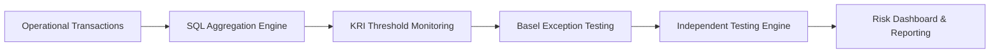
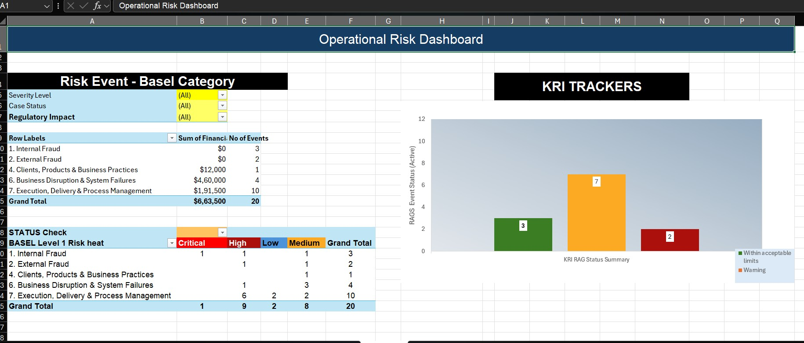

# Automated Operational Risk Testing Framework

Operational Risk Monitoring & Basel II Testing Framework built using:

**Excel → SQL → Python Automation**

Designed to simulate a real-world **2LoD Operational Risk Independent Testing environment** used across financial institutions.

## Target Outcome

- 97% reduction in audit execution time
- Zero-error Basel exception testing
- Automated transaction aggregation & control validation

---

# Framework Architecture

---

# Why I Built This

Most Operational Risk portfolio projects focus only on theory.

I wanted to build something closer to how Independent Monitoring & Testing functions operate inside financial institutions:

- Connected risk flows
- Basel classification mapping
- KRI monitoring
- Transaction-level aggregation
- Exception testing
- Automated audit workflows

This project was built to simulate a scalable enterprise ORM testing environment.

---

# Project Evolution

| Phase | Technology | Objective | Status | Target Completion |
|---|---|---|---|---|
| Phase 1 | Excel ORM Tracker | Manual ORM workflow simulation | Completed | 10 May 2026 |
| Phase 2 | SQL Audit Engine | Automated transaction aggregation & compliance linkage | In Progress | 25 May 2026 |
| Phase 3 | Python Automation | Basel exception testing automation using Pandas | In Progress | 30 May 2026 |
| Phase 4 | Power BI Integration | Executive risk dashboarding | Planned | June 2026 |
---

# Impact Metrics

| Metric | Before | Target After Automation |
|---|---|---|
| Audit Execution Time | 6+ Hours | <10 Minutes |
| Manual Testing Steps | 100+ | Fully Automated |
| Error Risk | High | Near Zero |
| Quarterly Tests | 14 | Scalable |
| Data Aggregation | Manual | SQL Driven |

---

# Planned Enhancements

- Automated exception alert engine
- Email-based escalation workflow
- Power BI live dashboard integration
- Control effectiveness scoring
- Risk trend forecasting
- API-based transaction ingestion
- Machine learning anomaly detection

---

# Preview

## Operational Risk Event Log0

## KRI Monitoring Dashboard

---

# Author

## Aishwarya Sivakumar

Aspiring Operational Risk / Risk Analytics Professional focused on:

- Operational Risk Management
- Basel Frameworks
- Risk Automation
- SQL & Python-Based Audit Analytics

### LinkedIn
linkedin.com/in/aishwarya-sivakumar1385
